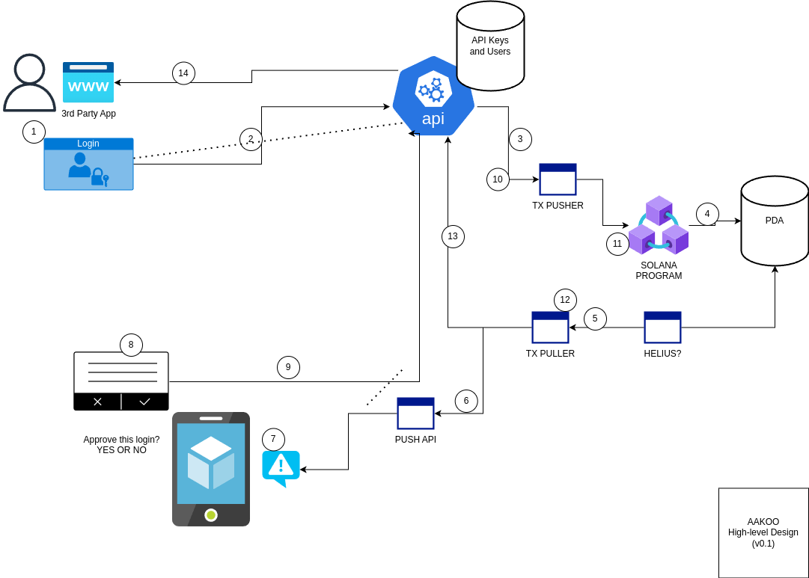

# aakoo high level (v0.1)



## high-level end-to-end flow of Aakoo System

1. An enrolled user logins to the 3rd party app. After the usual login, they will be prompted to do 2nd Authentication (similar to OTP or SMS code).

2. Submit request to API. Additionally, this will open a websocket or http poll that will listen to the API
```js
{
    user: pubkey
    app: pubkey
}
```

3. Create a tx that will create a PDA to save the verification state

4. SOL program will save the state to a PDA. The state should have the ff info
```
{
    userKey
    appKey
    timestamp
    isVerified
}
```

5. A listening service (probably utilize Helius or similar) will detect a change in the program/state

6. Submit a push notif targeting the user requesting

7. Mobile phone will receive the push notification

8. User will sign/approve the login request

9. Call API containing the ff
```
    userKey
    appKey
    signature
    timestamp
```

10. Create a tx to verify the payload above through Solana program

11. Solana program will verify the paylad against the state saved in #4

12. Tx puller will receive change in the state

13. Forward information to the API and perform update to the listening websocket or http poll in #2

14. User will be successfully logged-in!


## definition of terms
* enrolled user